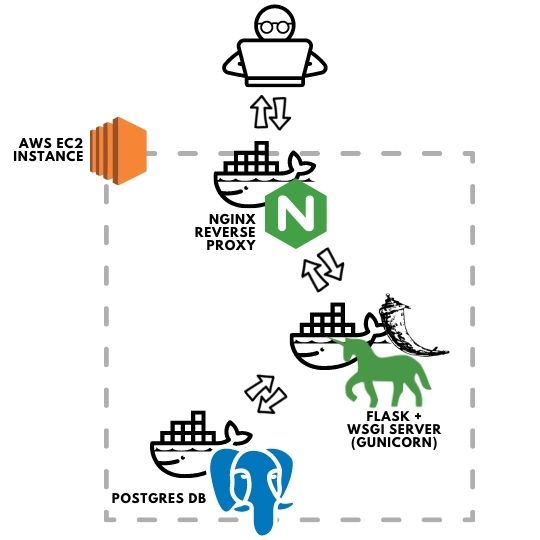

# Flask Web App 

## About The Project

Built a toy Ecomm website, aiming to improve API Development and Web Development skills.
The application has a registration and login system for users, keeping track of the user's budget and Items purchased.

The system has three services, the main Flask app, an Nginx server setup as a reverse proxy and a Postgres database.
They all run in docker containers and were deploy on an EC2 machine.

 

## Built With

- Flask
- Gunicorn
- Bootstrap
- Docker
- Nginx (working as a reverse proxy)
- Sqlite (development data base)
- Prosgres (production data base)

 

## Architecture

